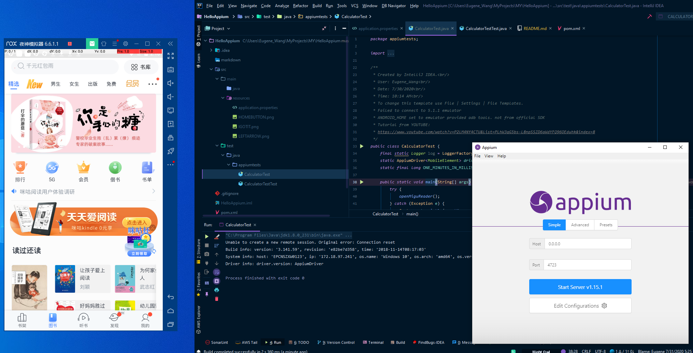
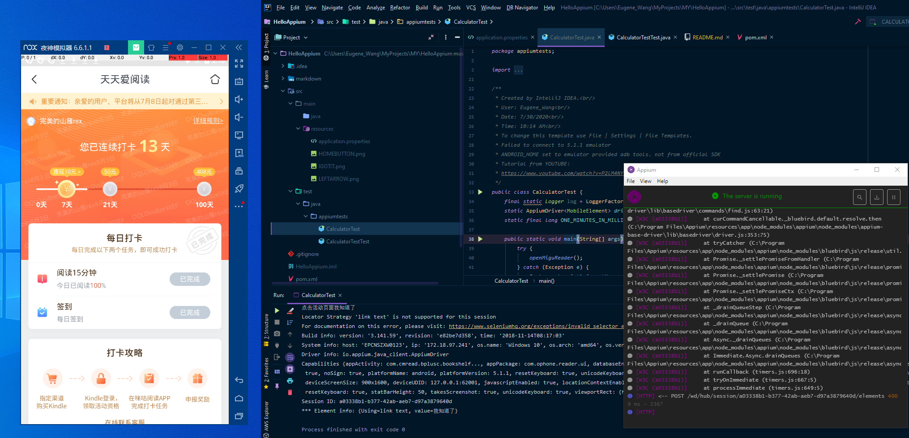

<ol>
 <li>There is serious compatible issue with SDK version and Appium Version and Android Emulator Version</li>
 <li>Appium 1.16 not compatible with Nox Emulator Android version 5.1.1</li>
 <li>Appium 1.15 compatible with Nox Emulator Android version 5.1.1</li>
 <li>Android SDK version 5.1 Lollipop</li>
 <li>Don't use AVD from Android studio, x86 version not compatible with apk compiled with arm instructions</li>
 </ol>
 
## Steps to set up the automated app testing environment
<ol>
<li>get Java and set up JAVA_HOME</li>
<li>get NodeJs installed version 6.12.1 npm --version</li>
<li>get Android Studio installed </li>
<li>install SDk (5.1 API level 24) via Android Studio, set Android_HOME environment variable</li>
<li>install Appium version 1.15</li>
<li>check with appium-doctor --android for dependencies completeness</li>
<li>install APK info to find the required info for app activity </li>
<li>install cmake first </li>
<li>https://github.com/Kitware/CMake/releases/download/v3.18.1/cmake-3.18.1-win64-x64.msi</li>
<li>npm i -g opencv4nodejs</li>
</ol>

##夜神模拟器5.1.1
设置-》开发者模式-》打开坐标/打开USB调试/ 

## version 一定要对，版本不对，连不上！
正确的版本

RUNNING

##Author 
Eugene Wang ALLRIGHTS RESERVED@2020
[GIT](https://github.com/sail456852/HelloAppium)
